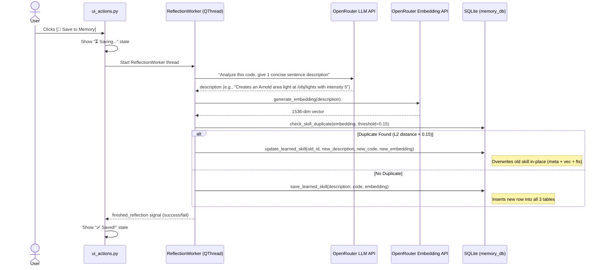

# Agent Flow Deep Dive: Embeddings, Memory & Self-Learning

This document provides a complete, code-verified explanation of how the Houdini-LLM agent uses embeddings, manages its memory (Learned Skills & Anti-Patterns), and performs self-learning via the Hermes Reflection Loop. Every statement is traced back to the exact source file and function.

---

## Table of Contents

1. [The Complete Agent Pipeline (Per-Prompt)](#1-the-complete-agent-pipeline-per-prompt)
2. [When Are Embeddings Generated?](#2-when-are-embeddings-generated)
3. [Anti-Patterns: What They Are & When They Are Saved](#3-anti-patterns-what-they-are--when-they-are-saved)
4. [The Hermes Self-Learning / Reflection Loop](#4-the-hermes-self-learning--reflection-loop)
5. [Deduplication: What Happens With Similar Code](#5-deduplication-what-happens-with-similar-code)
6. [Context Management: Short-Term vs Long-Term](#6-context-management-short-term-vs-long-term)
7. [The Arnold Light Scenario (Worked Example)](#7-the-arnold-light-scenario-worked-example)
8. [Embedding Cost Summary Table](#8-embedding-cost-summary-table)
9. [File Reference Map](#9-file-reference-map)

---

## 1. The Complete Agent Pipeline (Per-Prompt)

When you type a prompt and press Enter, this exact sequence executes:

```mermaid
sequenceDiagram
    actor User
    participant UI as ui.py (on_send_clicked)
    participant Worker as workers.py (AgentWorker)
    participant Core as core.py (generate_response_stream)
    participant LLM as OpenRouter LLM API
    participant Tools as mcp_tools.py (execute_tool)
    participant DB as SQLite (memory_db / vector_db)
    participant Embed as OpenRouter Embedding API

    User->>UI: Type prompt + press Enter
    UI->>UI: Save user message to DB immediately
    UI->>Worker: Start AgentWorker thread

    Note over Worker: Auto-compact check (>80% token usage)

    Worker->>Core: generate_response_stream()
    Core->>LLM: Send messages + tool schemas (streaming)
    LLM-->>Core: Stream response chunks (text + tool_calls)

    rect rgb(40, 40, 60)
        Note right of LLM: Tool Call Loop (LLM decides which tools to call)
        
        LLM->>Tools: search_memory(query)
        Tools->>Embed: generate_embedding(query) — 1 API call
        Embed-->>Tools: 1536-dim vector
        Tools->>DB: Hybrid search (Vec L2 + FTS5 via RRF)
        DB-->>LLM: Past skills + anti-patterns

        LLM->>Tools: search_api_docs(query)
        Tools->>Embed: generate_embedding(query) — 1 API call
        Embed-->>Tools: 1536-dim vector
        Tools->>DB: Hybrid search houdini_docs
        DB-->>LLM: Relevant Houdini API docs

        LLM->>Tools: get_node_parameters(node_type)
        Note right of Tools: No embedding needed (live Houdini inspection)
        Tools-->>LLM: Exact parameter names from live scene

        LLM->>Tools: propose_code_change(python_code)
        Tools->>Tools: ast.parse() syntax check
        alt Syntax Fail (up to 3x)
            Tools-->>LLM: Error + instruction to fix
        else Syntax Pass
            Tools-->>UI: Code proposed for user review
        end
    end

    Core-->>Worker: Stream finished
    Worker-->>UI: finished_response signal
```



### Key Insight
The LLM decides which tools to call and in what order. The persona system prompts (e.g., `general_td.py`) contain **strict instructions** telling the LLM it "MUST" call `search_memory` first, then `search_api_docs`, then inspect live nodes, and finally `propose_code_change`. The code in `core.py` does not enforce this order programmatically — it is enforced purely through prompt engineering in the persona.

**Source:** `scripts/python/personas/general_td.py` lines 13-19, `scripts/python/core.py` lines 236-445

---

## 2. When Are Embeddings Generated?

Embeddings are **not** generated for every prompt you type. They are only generated when specific tools are invoked. Here is the exhaustive list:

| Trigger | Embedding Count | Source Function | Purpose |
|---------|:-:|---|----|
| `search_memory` tool called | **1** | `mcp_tools.search_memory()` → `core.generate_embedding()` | Convert user query to vector for searching past skills + anti-patterns |
| `search_api_docs` tool called | **1** | `rag/tools.search_api_docs()` → `core.generate_embedding()` | Convert query to vector for searching Houdini docs |
| User clicks **[🌟 Save to Memory]** | **1** | `workers.ReflectionWorker.run()` → `core.generate_embedding()` | Embed the LLM-generated description of the successful code |
| Code crashes after **[✅ Approve & Run]** | **1** | `ui.on_approve_code()` → `core.generate_embedding()` | Embed the traceback (first 1500 chars) for anti-pattern storage |
| RAG ingestion (`build_rag_database.bat`) | **1 per chunk** | `rag/ingest.ingest_zip()` → `core.generate_embedding()` | One-time bulk ingestion of Houdini help docs |

### Per-Prompt Total
For a typical agentic prompt where the LLM calls both `search_memory` and `search_api_docs`:
- **2 embedding API calls** (one per search tool) — **read-only**, nothing is written to the DB.

**Source:** `scripts/python/mcp_tools.py` lines 199-225, `scripts/python/rag/tools.py` lines 22-39

---

## 3. Anti-Patterns: What They Are & When They Are Saved

### What They Are
Anti-Patterns are records of **code that passed the syntax check, was approved by the user, but crashed during live execution inside Houdini**. They contain:
- `error_type`: The Python exception class name (e.g., `AttributeError`)
- `traceback_str`: The full Python traceback
- `failed_code`: The exact code that crashed
- `fix_description`: A generated hint (e.g., "Failed with AttributeError. Ensure API calls are valid.")
- `embedding`: A 1536-dim vector of the traceback (first 1500 chars)

### When They Are NOT Saved
- ❌ During code generation (syntax errors during the LLM's drafting phase are silently retried up to 3 times and **never** saved to the DB)
- ❌ When the user clicks **[❌ Reject]** on the Yellow Review Panel (the code is simply discarded)

### When They ARE Saved
- ✅ **Only** when the user clicks **[✅ Approve & Run]** AND the code throws a runtime exception during `exec()`.

### Exact Code Path
1. User clicks "✅ Approve & Run" → `ui.py:on_approve_code()` is called
2. Code runs inside `exec()` wrapped in a `hou.undos.group`
3. If `exec()` raises an exception:
   a. A background thread is spawned (`threading.Thread`)
   b. That thread calls `core.generate_embedding(trace[:1500])` — **1 embedding API call**
   c. Then calls `memory_db.save_anti_pattern()` which inserts into 3 tables:
      - `anti_patterns` (vec0 virtual table — the vector)
      - `anti_patterns_meta` (the metadata: error_type, traceback, failed_code, fix_description)
      - `anti_patterns_fts` (FTS5 full-text index for keyword search)

**Source:** `scripts/python/ui.py` lines 252-331, `scripts/python/memory_db.py` lines 242-267

---

## 4. The Hermes Self-Learning / Reflection Loop

The Reflection Loop is triggered **exclusively** by the user clicking the **[🌟 Save to Memory]** button on a code block inside the chat UI. It is **never** triggered automatically.

### Step-by-Step Flow



### What Gets Stored (Per Learned Skill)
Three synchronized table entries:
1. **`learned_skills`** (vec0): The 1536-dim embedding vector (for semantic search)
2. **`learned_skills_meta`**: `id`, `description` (LLM summary), `code` (raw Python), `created_at`
3. **`learned_skills_fts`** (FTS5): `description` + `code` (for keyword search)

### API Calls Per Star Click
- **1 LLM call** (to `generate_response_sync` for summarization)
- **1 Embedding call** (to `generate_embedding` for vectorizing the summary)

**Source:** `scripts/python/workers.py` lines 53-120, `scripts/python/ui_actions.py` lines 84-120

---

## 5. Deduplication: What Happens With Similar Code

### How It Works
When the `ReflectionWorker` is about to save a new skill, it first calls `check_skill_duplicate()`:

```python
# memory_db.py line 92
def check_skill_duplicate(db_path, embedding, threshold=0.15):
    """Checks if a nearly identical skill exists (distance < threshold)"""
    row = conn.execute("""
        SELECT id, vec_distance_L2(embedding, ?) as distance
        FROM learned_skills
        WHERE distance < ?
        ORDER BY distance ASC
        LIMIT 1
    """, (embedding_bytes, threshold)).fetchone()
    return dict(row) if row else None
```

- **Threshold = 0.15** (L2 distance). This is very tight — only nearly identical semantic meanings will match.
- If a match is found → **UPDATE** the existing row (new code overwrites old code, new description overwrites old description, new embedding overwrites old embedding, timestamp is refreshed).
- If no match is found → **INSERT** a brand new skill.

### Important Detail
The deduplication compares the **description embeddings**, not the raw code. So:
- "Create an Arnold area light at /obj/lights" vs. "Create an Arnold area light at /obj/my_lights" → **likely a duplicate** (semantic meaning nearly identical, L2 < 0.15) → old skill is updated with new code.
- "Create an Arnold area light" vs. "Create a Pyro simulation" → **not a duplicate** (very different semantics, L2 >> 0.15) → new skill is inserted.

**Source:** `scripts/python/memory_db.py` lines 92-135

---

## 6. Context Management: Short-Term vs Long-Term

Houdini-LLM maintains multiple layers of context, each with different lifetimes and persistence rules.

### The Five Context Layers

| Layer | Storage | Lifetime | Affected by `/compact` |
|-------|---------|----------|:---:|
| **System Prompt** | In-memory (persona file + `houdini_context.py` selected nodes) | Rebuilt fresh per request | ❌ |
| **Chat Messages** | `messages` table in SQLite | Until `/compact` trims or session deleted | ✅ Old messages summarized & deleted |
| **Session Summary** | `sessions.summary` column | Until session deleted | ✅ Updated with new summary |
| **Long-Term Memory** | `learned_skills` + `anti_patterns` (vector tables) | **Permanent** | ❌ Never touched |
| **RAG Knowledge** | `houdini_docs` (vector table) | **Permanent** (one-time ingestion) | ❌ Never touched |

### How `/compact` Works

When the user types `/compact` (or auto-compact triggers at >80% token usage):

1. All messages **except the last 5** are extracted from the `messages` table.
2. Those messages + any existing session summary are sent to the LLM with a summarization prompt.
3. The LLM returns a dense, unified summary.
4. The old messages are **deleted** from the `messages` table.
5. The new summary is saved to `sessions.summary`.
6. On future requests, this summary is injected as a system message before the remaining chat messages.

### Critical Rule
`/compact` has **zero effect** on the Vector DB. Learned Skills and Anti-Patterns persist permanently across all sessions. Even if your entire chat history is wiped, the agent's long-term memory remains intact.

**Source:** `scripts/python/context_manager.py` lines 35-96, `scripts/python/workers.py` lines 28-37

---

## 7. The Arnold Light Scenario (Worked Example)

Let's trace your exact scenario step by step:

### Prompt 1: "Create an Arnold light"
1. **search_memory** → generates 1 embedding, searches DB → no skills found (empty DB).
2. **search_api_docs** → generates 1 embedding, finds Arnold docs from RAG.
3. **get_node_parameters("arnold_light")** → inspects live Houdini scene, returns exact parameter names. No embedding.
4. **propose_code_change** → writes Python code → passes syntax check → Yellow Review Panel appears.
5. You click **[✅ Approve & Run]** → code executes successfully.
6. You click **[🌟 Save to Memory]** → ReflectionWorker:
   - LLM summarizes: *"Creates an Arnold area light node under /obj with default settings"*
   - Generates 1 embedding of that summary.
   - `check_skill_duplicate` → no match (DB was empty) → **INSERT** new skill.
   - **Embedding calls this prompt: 2 (search) + 1 (reflection) = 3 total**

### Prompt 2: "Create another Arnold light with intensity 10 and color red"
1. **search_memory** → generates 1 embedding, searches DB → **finds** the skill from Prompt 1 (the previously saved "Create an Arnold area light" code + description).
2. **search_api_docs** → generates 1 embedding, finds Arnold docs.
3. **get_node_parameters("arnold_light")** → gets exact parameter names again.
4. The LLM now has:
   - The **old proven code** from the skill (used as a reference template)
   - The **official API docs** from RAG
   - The **exact live parameter names** from get_node_parameters
   - It **generates completely new code** that adapts the old structure but applies the new values (intensity=10, color=red). It does NOT copy-paste the old code blindly.
5. **propose_code_change** → new code → syntax check → Yellow Review Panel.
6. You click **[✅ Approve & Run]** → success.
7. You click **[🌟 Save to Memory]** → ReflectionWorker:
   - LLM summarizes: *"Creates an Arnold area light with intensity 10 and red color"*
   - Generates 1 embedding of that summary.
   - `check_skill_duplicate(threshold=0.15)`:
     - **If L2 distance < 0.15** (very similar to "Creates an Arnold area light node under /obj with default settings"): → **UPDATE** → old skill is overwritten with the new, better code.
     - **If L2 distance >= 0.15** (different enough): → **INSERT** → a second separate skill is stored.
   - In practice, "Arnold area light with defaults" vs. "Arnold area light with intensity 10 and red color" are semantically close enough that they would **likely be deduplicated** (updated, not duplicated).

### Key Takeaway
The agent **always generates fresh code** on each prompt. Past skills serve as **reference templates** injected into the LLM's context — the LLM adapts them to fit the new request. The old code is never executed directly.

---

## 8. Embedding Cost Summary Table

| Event | Embedding API Calls | LLM API Calls | DB Writes |
|-------|:-:|:-:|:-:|
| Normal prompt (agent calls search_memory + search_api_docs) | 2 | 1 (streaming) | 0 (read-only) |
| Code crashes after Approve & Run | 1 (traceback) | 0 | 1 anti-pattern |
| User clicks [🌟 Save to Memory] | 1 (description) | 1 (summarization) | 1 learned skill (insert or update) |
| `/compact` command | 0 | 1 (summarization) | 0 (updates session summary, deletes old messages) |
| RAG ingestion (one-time setup) | 1 per chunk (hundreds) | 0 | 1 doc per chunk |

---

## 9. File Reference Map

| File | Role |
|------|------|
| `core.py` | Central orchestrator: session management, LLM streaming, embedding generation, tool-call loop |
| `mcp_tools.py` | Tool definitions (schemas) + tool dispatcher (`execute_tool`) |
| `memory_db.py` | All Learned Skills + Anti-Patterns CRUD + Hybrid search (Vec + FTS5 + RRF) |
| `rag/vector_db.py` | Houdini docs CRUD + Hybrid search |
| `rag/tools.py` | `search_api_docs` tool implementation |
| `rag/ingest.py` | One-time RAG ingestion pipeline (reads Houdini help .zip files) |
| `workers.py` | `AgentWorker` (streaming thread) + `ReflectionWorker` (learning thread) |
| `ui.py` | Main UI class: wires signals, handles approve/reject/retry |
| `ui_actions.py` | UI action handlers: copy, run, save-to-memory, manage memory dialog |
| `ui_builder.py` | UI layout construction |
| `ui_render.py` | Chat rendering logic |
| `ui_session.py` | Session list management |
| `database.py` | SQLite connection pool + session/message tables + DB initialization |
| `context_manager.py` | Token estimation + `/compact` session summarization |
| `houdini_context.py` | Live Houdini scene introspection (selected nodes context) |
| `personas/*.py` | Per-domain system prompts (General TD, Arnold, Solaris, FX) |
| `chat_formatter.py` | Markdown → HTML rendering for the chat display |
| `styles.py` | Global CSS/QSS stylesheet for the UI |
| `settings_dialog.py` | API key settings dialog |
| `components.py` | Reusable UI widget components |
