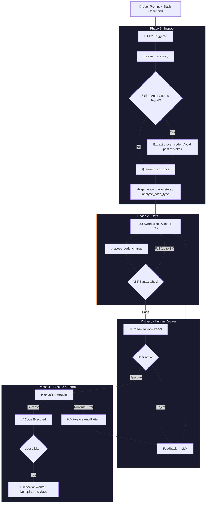
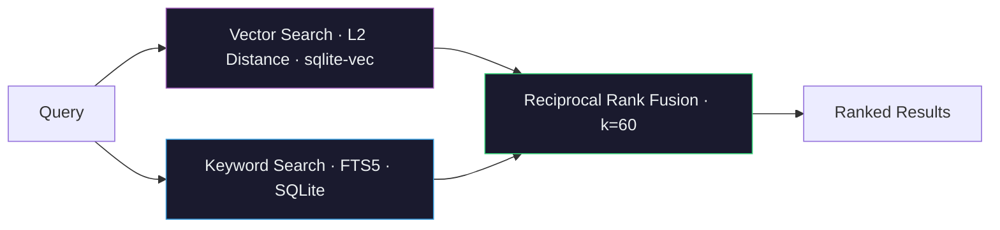

# Houdini-LLM: Architecture at a Glance

The entire system is built around one rule: **Never Guess.**

LLMs guess parameter names. Houdini's API changes across versions. A guess like `radius` when the real name is `rad` crashes the script. Houdini-LLM eliminates guessing by forcing the agent to **inspect before it acts** and **learn from every outcome**.

> For detailed code-traced explanations, worked examples, and embedding cost breakdowns, see **[Agent Flow Deep Dive](agent_flow_deep_dive.md)**.

---

## The Strict Execution Pipeline

---

## The Four Pillars

```mermaid
graph LR
    subgraph BRAIN["🧠 The Brain"]
        B1["core.py · Orchestrator"]
        B2["personas/ · Slash Command Router + Domain Prompts"]
        B3["houdini_context.py · Global Safety Prompt"]
    end

    subgraph EYES["👁️ The Eyes"]
        E1["search_memory · Past Skills & Errors"]
        E2["search_api_docs · RAG Houdini Docs"]
        E3["get_node_parameters · Live Scene"]
        E4["analyze_node_type · Node Constraints"]
    end

    subgraph MEMORY["💾 The Memory · 1 SQLite File"]
        M1["Learned Skills · Vector + FTS5"]
        M2["Anti-Patterns · Vector + FTS5"]
        M3["Houdini Docs · RAG Vector + FTS5"]
        M4["Sessions & Messages"]
    end

    subgraph HANDS["🤲 The Hands"]
        H1["propose_code_change · AST Check"]
        H2["Yellow Review Panel · HITL"]
        H3["exec in hou.undos.group"]
    end

    BRAIN --> EYES
    EYES --> MEMORY
    BRAIN --> HANDS

    style BRAIN fill:#1a1a2e,stroke:#9b59b6,color:#ecf0f1
    style EYES fill:#1a1a2e,stroke:#3498db,color:#ecf0f1
    style MEMORY fill:#1a1a2e,stroke:#e67e22,color:#ecf0f1
    style HANDS fill:#1a1a2e,stroke:#2ecc71,color:#ecf0f1
```

---

## Context Management

| Layer | Mechanism | Lifetime | Affected by `/compact` |
|-------|-----------|----------|:---:|
| **System Prompt** | Global prompt + persona prompt (via slash cmd) + live scene context | Per-request | ❌ |
| **Short-Term Context** | Session messages in `messages` table | Until `/compact` or session deleted | ✅ Summarized & trimmed |
| **Session Summary** | LLM-generated summary in `sessions.summary` | Until session deleted | ✅ Updated |
| **Long-Term Memory** | Learned Skills + Anti-Patterns in vector DB | Permanent | ❌ Never touched |
| **RAG Knowledge** | Houdini docs in vector DB | Permanent (one-time ingestion) | ❌ Never touched |

> `/compact` summarizes old chat messages into a dense summary and deletes them to free up context window tokens. It has **zero effect** on the vector DB. Skills and anti-patterns persist permanently across all sessions.

---

## Hybrid Search Engine

Every search (memory, docs, anti-patterns) uses the same dual-path strategy:

- **Vector path**: Captures semantic similarity ("make a sphere" → finds sphere-related code)
- **Keyword path**: Captures exact API matches (`hou.SopNode.geometry()` → exact hit)
- **RRF blending**: Mathematically fuses both ranked lists so neither path dominates
