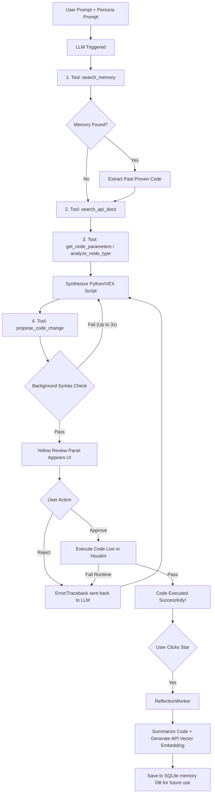

# Houdini-LLM: The Dedicated Agentic Workflow

Houdini-LLM operates exclusively as an autonomous Agentic Workflow. There is no raw "chat only" mode. Every user request follows a strict, deterministic sequence of tool usage to guarantee consistency, accuracy, and continuous self-improvement.

## 1. Introduction: Achieving 100% Accuracy
One of the greatest strengths of building an AI inside Houdini is SideFX's incredibly comprehensive `hou` Python API. Almost every single node, parameter, and UI element in Houdini is exposed to this API. Conceptually, if a human can click it with a mouse, the AI can code it.

However, a raw Large Language Model (LLM) alone cannot achieve 100% accuracy out-of-the-box. LLMs are trained on massive amounts of internet data, and Houdini's API changes across versions. An LLM might guess that a Sphere node has a parameter called `radius`, but the actual exact parameter name is `rad`. If the LLM blindly guesses, the script will fail.

To solve this, Houdini-LLM abandons "guessing" entirely. Instead, it uses a combination of **Agentic Inspection Tools (The Eyes)** and the **Hermes Self-Learning Loop (The Brain)** to force the AI to converge toward 100% accuracy over time.

---

## 2. The Strict Execution Pipeline

No matter how many times the same prompt is run, the Agent strictly follows this exact order:

### Step 1: The Historical Check (The "Brain")
Before writing any code, the Agent **must** use the `search_memory` tool. It queries the local SQLite Vector DB. If a reflection memory (from a previous successful session) is found, the Agent will prioritize extracting and adapting that proven script, ensuring it doesn't solve the same problem twice.

### Step 2: The Documentation Check (RAG)
Whether memory is found or not, the Agent **must** query the `search_api_docs` tool. This embeds the query, checks the local `houdini_docs` vector database, and pulls the exact Houdini `hou` API syntax and Gotchas to ensure it is using the correct version's logic.

### Step 3: The Live API Check (The "Eyes")
The Agent uses `get_node_parameters` or `analyze_node_type` to directly inspect the live node graph in your actual Houdini scene. Rather than guessing, it actively collects the exact internal parameter names, ramps, and tuple definitions required to manipulate your specific nodes.

### Step 4: Background Validation
The Agent synthesizes the script and calls `propose_code_change`. Before you even see it, the system runs a lightweight AST syntax check in the background. If there are basic indentation or Python syntax errors, the Agent is silently rebuffed and forced to fix it (up to 3 times) before giving up.

### Step 5: Human-in-the-Loop Review (HITL)
Once syntax passes, the yellow review panel appears in the UI. You review the proposed code. If you approve, the script executes live in the Houdini session. If execution fails, the traceback is immediately fed back to the Agent, and the loop safely restarts.

### Step 6: The Hermes Self-Learning Loop
**The "50 Fails vs 1 Success" Problem:** An Agent might fail 50 times before finally writing the perfect script. If the agent memorized everything automatically, it would memorize all 50 broken attempts!

To prevent this, the learning loop requires your explicit permission. When the code succeeds and you are satisfied, you manually trigger the **[🌟 Save to Memory]** button. A background `ReflectionWorker` seamlessly sends the perfect code to the LLM for summarization, embeds that summary, and saves the vector to the SQLite DB. Over time, for your specific workflow, the agent literally converges toward 100% accuracy.

---

## 3. Architecture & Design Principles

### Modular Personas
To ensure our prompts remain concise and adhere to best practices (like the 450-line rule), all Persona logic is decoupled from the core engine. Each agent (e.g., `arnold_expert.py`, `fx_expert.py`) lives in its own tiny file in the `scripts/python/personas/` directory, containing only its specific system prompt. If a user switches Personas mid-session, a yellow warning is seamlessly injected into the chat.

### Lightweight Vector Embedding
Generating embeddings for the Memory DB uses **ZERO local GPU, CPU, or RAM**. Because we are already connected to an LLM provider via API, we leverage OpenRouter's API to generate the vector embeddings. The API does the math in milliseconds and returns the vector, which is instantly saved to SQLite.

### Short-Term Context vs. Long-Term Memory
The UI includes a `/compact` command to prevent token limits from maxing out. 
- **Short-Term Context:** `/compact` summarizes the current chat window.
- **Long-Term Memory:** `/compact` has **zero effect** on the Vector DB. The Vector DB is permanent Long-Term Memory. Even if your chat history is completely wiped, the skills the agent learned remain permanently accessible.

### Managing Memory
If you accidentally save a bad skill, or if a particular workflow becomes outdated, you are in full control. The **"🧠 Manage Memory"** button in the UI opens a list of all your saved vector skills, allowing you to manually delete anything you want the agent to forget.
